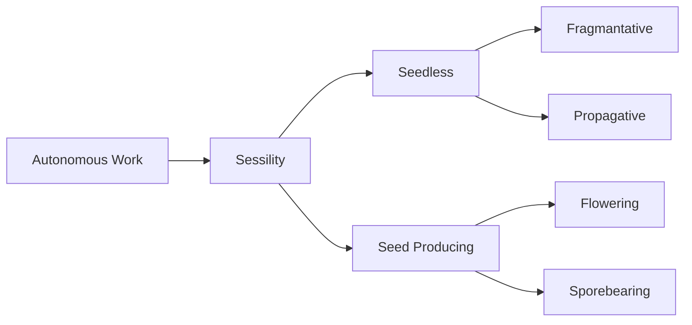
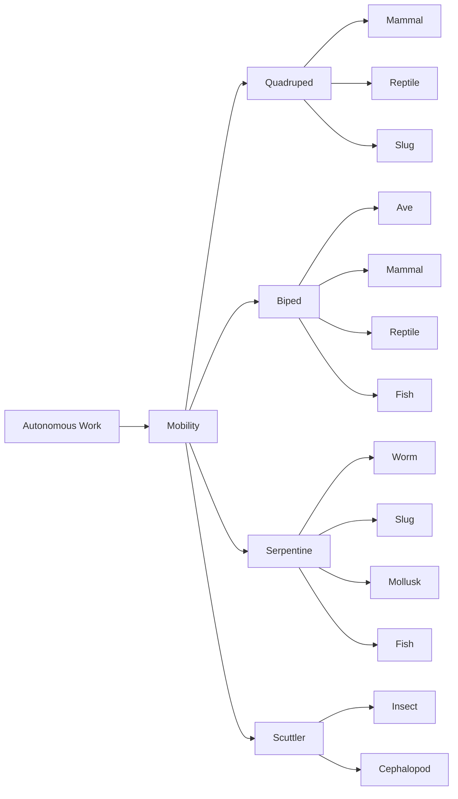
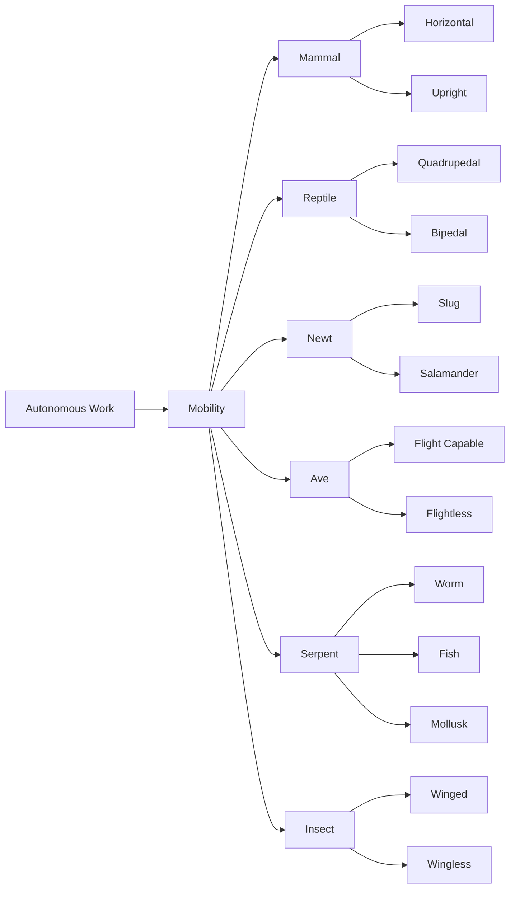

> [!note]
> This page is a stub and has more information that can be added.

Evolutionary classification is a system of [[Encyclopedia Mysenvaria/Culture/Sciences & Technologies/Scientific Branches/Taxonomy|taxonomic]] classification of [[Encyclopedia Mysenvaria/Biology/Organisms|organisms]] which poses that organisms may be divided into groups based on history of creation, similarity of concept, and execution by the Gods. This type of classification gives rise to a tree-like structure showing the evolution of concepts Gods had while creating organisms during the [[Encyclopedia Mysenvaria/History/God-War Era/God-War Era|God-War]].
# History

# Taxa
Evolutionary classification divides organisms into conceptual groups known as taxa. A taxon includes one or more populations of conceptually related organisms. There is a hierarchy of taxonomic ranks which taxa may be organized into based on conceptual importance. For instance, [[Encyclopedia Mysenvaria/Biology/Classifications/Plant|plants]] and [[Encyclopedia Mysenvaria/Biology/Classifications/Animal|animals]] are of highest conceptual importance since they are defined by an idea which permeates all other ranks; those ideas being sessile organisms for primarily defense, and mobile organisms for primarily offense.
# Classification
Classification of organisms into evolutionary taxa is an ongoing and widely debated topic amongst biologists and taxonomists across the [[Encyclopedia Mysenvaria/Geography/Natural Features/Plane|Plane]]. Plants are generally agreed upon, their classification made simply by the fact that their methods of reproduction and locomotion are intrinsically tied, as opposed to in animals. Plants were originally created with the overarching concept of autonomous work, which gave rise to sessility, which would give rise to sessile organisms which could reproduce sexually and organisms which could reproduce asexually.

Classification of animals however is widely considered to be much more complex. As opposed to plants, in animal groups any form of locomotion may not be intrinsically tied to form of reproduction. Body plans may give rise to any form of reproduction or locomotion, and vice versa. Because of the muddled conceptual links between these ideas there is a great debate amongst scientists as to how exactly animal groups should be organized. Two primary taxonomic organizations have arisen for animals within evolutionary classification.

The first, originally proposed by [[Encyclopedia Mysenvaria/History/Biographies/Jack Horner|Jack Horner]], is based upon the original idea of tri-criterial classification. Horner proposed that the number of limbs used by an organism to move itself is more important than the general body plan of the organism. Using the locomotive groups set forward by [[Encyclopedia Mysenvaria/Culture/Sciences & Technologies/Scientific Theories & Laws/Tri-Criterial Classification|tri-criterial classification]] Horner divided animals into 4 groups based off of how many limbs they use to propel themselves and then further divided those groups into body plan. Because of the way the system works body plans repeat themselves across different locomotive groups.

Horner believed that the Gods created animals with the greater concept of autonomous work by means of powered and sustained locomotion. This idea would end up giving way to the thought of number of limbs before it would give way to the thought of body plan.

The second form of organizing animals, proposed by [[Encyclopedia Mysenvaria/History/Biographies/Charles Darwin|Charles Darwin]], is instead based around the idea that the general body plan of an animal is of more significance than the actual number of limbs used for locomotion. Instead of grouping animals by number of limbs Darwin's classification system groups them by the style of locomotion. Darwin criticized Horner's view of the Gods, claiming that such rigid classifications based on number of limbs are not Godly and instead it is the greater picture that must be considered.

# Significance

# See Also