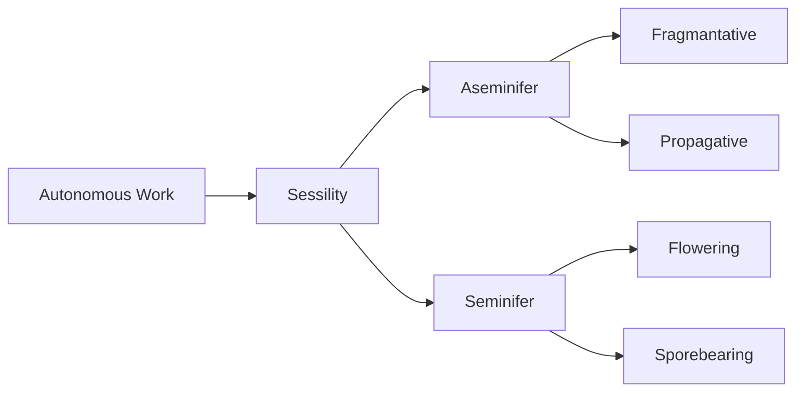
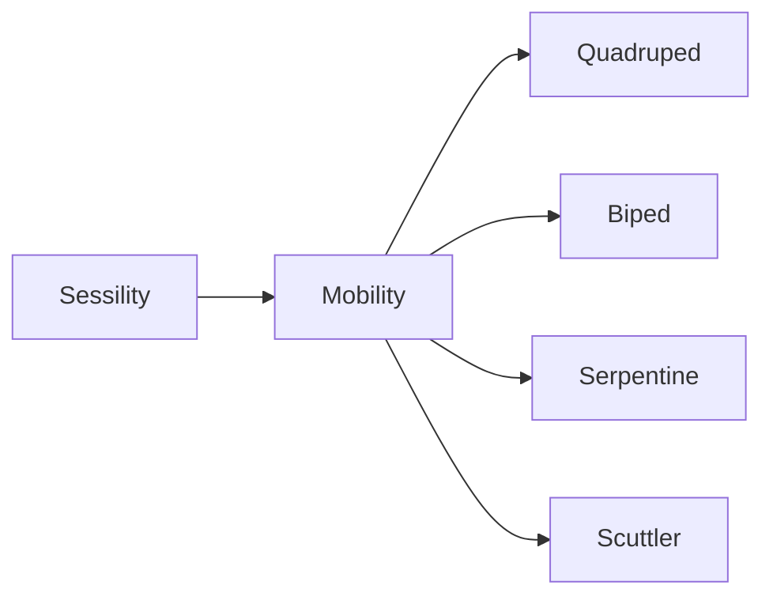
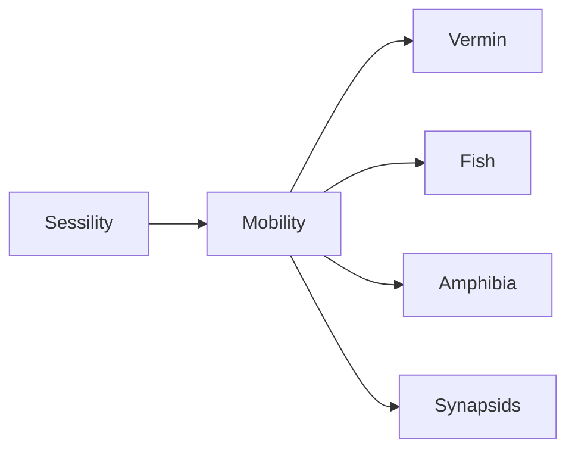

> [!note] Stub
> This page is a [[Meta/Stub|stub]], meaning it is incomplete. Help expand it by commenting or create a new [issue](https://github.com/RagtimeGal/quartz--encyclopedia-mysenvaria/issues/new/choose) on the git!

Evolutionary classification is a system of [[Encyclopedia Mysenvaria/Culture/Sciences & Technologies/Scientific Branches/Taxonomy|taxonomic]] classification of [[Encyclopedia Mysenvaria/Biology/Organisms|organisms]] which poses that organisms may be divided into groups based on history of creation, similarity of concept, and execution by the Gods. This type of classification gives rise to a tree-like structure showing the evolution of concepts Gods had while creating organisms during the [[Encyclopedia Mysenvaria/History/God-War Era/God-War Era|God-War]]. The idea of evolutionary classification is opposed to the idea of [[Encyclopedia Mysenvaria/Culture/Sciences & Technologies/Scientific Theories & Laws/Criterial Classification|tri-criterial classification]] which believes that organisms should not be organized by relativity of creation but instead simply by biological factors.
# History

# Taxa
Evolutionary classification divides organisms into conceptual groups known as taxa. A taxon includes one or more populations of conceptually related organisms. There is a hierarchy of taxonomic ranks which taxa may be organized into based on conceptual importance. For instance, [[Encyclopedia Mysenvaria/Biology/Plant|plants]] and [[Encyclopedia Mysenvaria/Biology/Animal|animals]] are of penultimate conceptual importance since they are defined by an idea which permeates all other ranks besides their predecessor; those ideas being sessile organisms for primarily defense, and mobile organisms for primarily offense.
# Classification
Classification of organisms into evolutionary taxa is an ongoing and widely debated topic amongst biologists and taxonomists across the [[Encyclopedia Mysenvaria/Geography/Natural Features/Plane|Plane]]. Plants are generally agreed upon, their classification made simple by the fact they were created with the objective of territorial definition and their methods of definition and reproduction are intrinsically tied, as opposed to in animals which were created to consume territory. The concept of autonomous work would give rise to sessility, which would give rise to plants which could reproduce [[Encyclopedia Mysenvaria/Biology/Taxa/Seminifer|sexually]] and plants which could reproduce [[Encyclopedia Mysenvaria/Biology/Taxa/Aseminifer|asexually]].

## Hornerian Classification
Classification of animals is widely considered to be much more complex. Animals were created with the objective of consuming territory and each other, directly warring organisms where locomotion and reproduction are not intrinsically tied. Body plans may give rise to any form of reproduction or locomotion. Because of the muddled conceptual links between these ideas there is a great debate amongst scientists as to how exactly animal groups should be organized. Two primary taxonomic organizations have arisen for animals within evolutionary classification.

The first, originally proposed by [[Encyclopedia Mysenvaria/History/Biographies/Jack Horner|Jack Horner]], is based upon the original idea of tri-criterial classification. [[Encyclopedia Mysenvaria/Culture/Sciences & Technologies/Scientific Theories & Laws/Hornerian Classification|Hornerian classification]] proposes that the number of limbs used by an organism to move itself is more important than the general body plan of the organism. Horner believed that the Gods created animals with the greater concept of autonomous work by means of powered and sustained locomotion. Horner believed this idea of locomotion would give way to thought on number of limbs before it would give way to thought of body plan. Hornerian thinking poses that despite similarities in general characteristics any animal which has a certain number limbs must not be significantly conceptually related to any other animal which does not have the same number of limbs.

Horner, using the [[Encyclopedia Mysenvaria/Culture/Sciences & Technologies/Scientific Theories & Laws/Body Plan|body plan]] criteria of tri-criterial classification would divide animals into 4 groups. The quadrupeds, which use four limbs for locomotion, bipeds which use two, serpents which use none, and scuttlers which use five or more.

## Darwinian Classification
Hornerian classification never gained widespread appeal, instead it would become the fundamental foundation of a theory later proposed by [[Encyclopedia Mysenvaria/History/Biographies/Charles Darwin|Charles Darwin]]. [[Encyclopedia Mysenvaria/Culture/Sciences & Technologies/Scientific Theories & Laws/Darwinian Classification|Darwinian classification]] believes that the Gods would not care for such external features as number of limbs and that conceptually animals are linked by their internals and general functioning. Darwin classified animals by similarity in bodily composition and function, splitting animals into 5 groups. Darwin posed that each group was created with an overarching objective in mind;
- [[Encyclopedia Mysenvaria/Biology/Taxa/Vermin|Vermin]]; c. BT 498; animals which lack an internal skeletal structure;
- [[Encyclopedia Mysenvaria/Biology/Taxa/Fish|Fish]]; c. BT 495; animals commonly characterized by their entirely aquatic lifestyles;
- [[Encyclopedia Mysenvaria/Biology/Taxa/Amphibia|Amphibia]]; c. BT 489; animals which often undergo metamorphosis, require moist skin to breathe;
- [[Encyclopedia Mysenvaria/Biology/Taxa/Synapsids|Synapsids]]; c. BT 475; typically terrestrial animals with uniquely adapted placenta. 

# Significance

# See Also