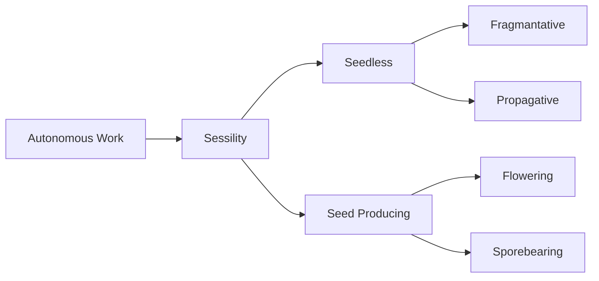
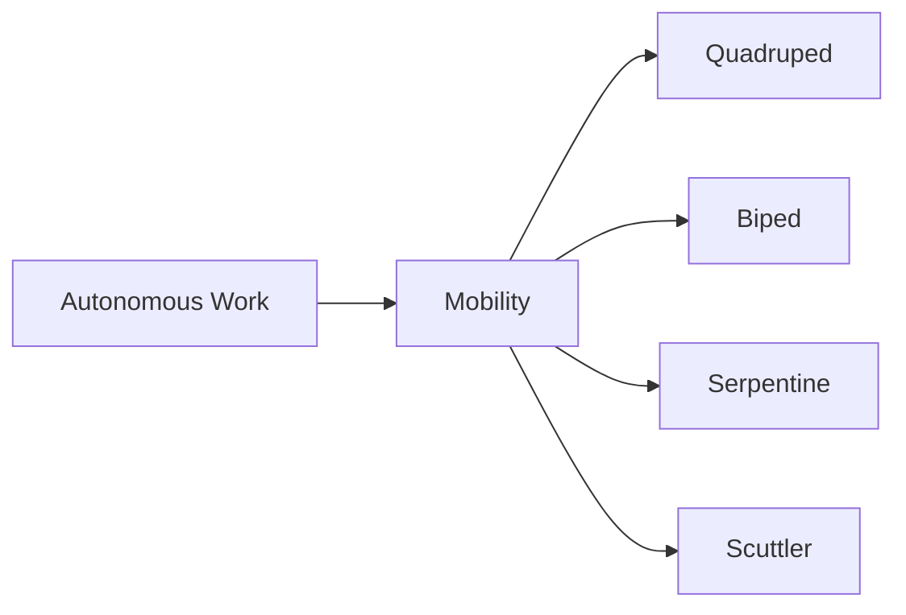
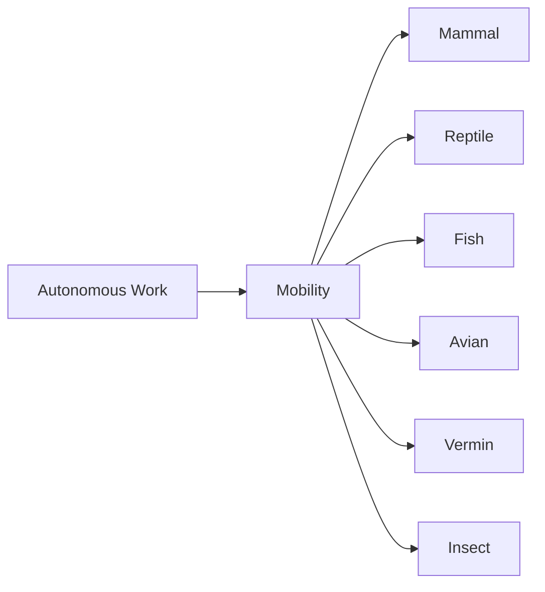

> [!note]
> This page is a stub and has more information that can be added.

Evolutionary classification is a system of [[Encyclopedia Mysenvaria/Culture/Sciences & Technologies/Scientific Branches/Taxonomy|taxonomic]] classification of [[Encyclopedia Mysenvaria/Biology/Organisms|organisms]] which poses that organisms may be divided into groups based on history of creation, similarity of concept, and execution by the Gods. This type of classification gives rise to a tree-like structure showing the evolution of concepts Gods had while creating organisms during the [[Encyclopedia Mysenvaria/History/God-War Era/God-War Era|God-War]]. The idea of evolutionary classification is opposed to the idea of [[Encyclopedia Mysenvaria/Culture/Sciences & Technologies/Scientific Theories & Laws/Tri-Criterial Classification|tri-criterial classification]] which simply believes that organisms should not be organized by relativity of creation but instead simply by biological factors.
# History

# Taxa
Evolutionary classification divides organisms into conceptual groups known as taxa. A taxon includes one or more populations of conceptually related organisms. There is a hierarchy of taxonomic ranks which taxa may be organized into based on conceptual importance. For instance, [[Encyclopedia Mysenvaria/Biology/Plant|plants]] and [[Encyclopedia Mysenvaria/Biology/Animal|animals]] are of highest conceptual importance since they are defined by an idea which permeates all other ranks; those ideas being sessile organisms for primarily defense, and mobile organisms for primarily offense.
# Classification
Classification of organisms into evolutionary taxa is an ongoing and widely debated topic amongst biologists and taxonomists across the [[Encyclopedia Mysenvaria/Geography/Natural Features/Plane|Plane]]. Plants are generally agreed upon, their classification made simply by the fact that their methods of reproduction and locomotion are intrinsically tied, as opposed to in animals. Plants were originally created with the overarching concept of autonomous work, which gave rise to sessility, which would give rise to sessile organisms which could reproduce sexually and organisms which could reproduce asexually.

## Hornerian Classification
Classification of animals however is widely considered to be much more complex. As opposed to plants, in animal groups any form of locomotion may not be intrinsically tied to form of reproduction. Body plans may give rise to any form of reproduction or locomotion, and vice versa. Because of the muddled conceptual links between these ideas there is a great debate amongst scientists as to how exactly animal groups should be organized. Two primary taxonomic organizations have arisen for animals within evolutionary classification.

The first, originally proposed by [[Encyclopedia Mysenvaria/History/Biographies/Jack Horner|Jack Horner]], is based upon the original idea of tri-criterial classification. [[Encyclopedia Mysenvaria/Culture/Sciences & Technologies/Scientific Theories & Laws/Hornerian Classification|Hornerian classification]] proposes that the number of limbs used by an organism to move itself is more important than the general body plan of the organism. Horner believed that the Gods created animals with the greater concept of autonomous work by means of powered and sustained locomotion. Horner believed this idea of locomotion would give way to thought on number of limbs before it would give way to thought of body plan. Hornerian thinking poses that despite similarities in general characteristics any animal which has a certain number limbs must not be significantly conceptually related to any other animal which does not have the same number of limbs.

Horner, using the [[Encyclopedia Mysenvaria/Culture/Sciences & Technologies/Scientific Theories & Laws/Body Plan|body plan]] criteria of tri-criterial classification would divide animals into 4 groups. The quadrupeds, which use four limbs for locomotion, bipeds which use two, serpents which use none, and scuttlers which use five or more.

## Darwinian Classification
Hornerian classification never gained widespread appeal, instead it would become the fundamental foundation of a theory later proposed by [[Encyclopedia Mysenvaria/History/Biographies/Charles Darwin|Charles Darwin]]. [[Encyclopedia Mysenvaria/Culture/Sciences & Technologies/Scientific Theories & Laws/Darwinian Classification|Darwinian classification]] believes that the Gods would not care for such external features as number of limbs and that conceptually animals are linked by their internals and general functioning. Darwin classified animals by similarity in internal composition and function, splitting animals into 6 groups; Mammals which consists of animals with mammary glands, reptiles whom cannot control their own body temperature, fish which always inhabit the water, aves which consist of feather-covered beaked animals, vermin consisting of , and insects consisting of animals with external skeletal shells.

# Significance

# See Also