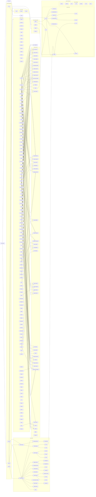

```mermaid
flowchart LR
LifeDeath[Life & Death]-->CreationQuadrinity
LifeDeath-->Harmony
Harmony-->Chaos
subgraph CreationQuadrinity[Creation Quadrinity]
Matter
Energy
Time
Space
end
Time-->TimeGods
subgraph TimeGods[Time Trinity]
Past
Present
Future
end
Matter-->MaterialStateGods
Energy-->MaterialStateGods
subgraph MaterialStateGods[Gods of Material States]
direction LR
Liquids
Gasses
Solids
Plasmas
end
Matter-->KineticEnergy
Matter-->PotentialEnergy
Energy-->KineticEnergy
Energy-->PotentialEnergy
subgraph EnergyGods[Energy Gods]
KineticEnergy[Kinetic Energy]
KineticEnergy-->MechanicalEnergy[Mechanical Energy]
MechanicalEnergy-->SoundEnergy[Sound Energy]
KineticEnergy-->ThermalEnergy[Thermal Energy]
ThermalEnergy-->Heat
ThermalEnergy-->Cold
PotentialEnergy[Potential Energy]
PotentialEnergy-->MechanicalEnergy
PotentialEnergy-->ElectricEnergy[Electric Energy]
ElectricEnergy-->Current
ElectricEnergy-->Voltage
ElectricEnergy-->Static
PotentialEnergy-->MagneticEnergy[Magnetic Energy]
MagneticEnergy-->Diamagnetism
MagneticEnergy-->Paramagnetism
PotentialEnergy-->GravitationalEnergy[Gravitational Energy]
PotentialEnergy-->ChemicalEnergy[Chemical Energy]
ChemicalEnergy-->Bond
ChemicalEnergy-->Combustion
PotentialEnergy-->IonizingEnergy[Ionizing Energy]
PotentialEnergy-->NuclearEnergy[Nuclear Energy]
NuclearEnergy-->RadioactiveDecay[Radioactive Decay]
NuclearEnergy-->Fission
NuclearEnergy-->Fusion
PotentialEnergy-->ChromodynamicEnergy[Chromodynamic Energy]
PotentialEnergy-->ElasticEnergy[Elastic Energy]
ElasticEnergy-->Deformation
PotentialEnergy-->RadiantEnergy[Radiant Energy]
PotentialEnergy-->Rest
end
Matter-->ElementalGods
subgraph ElementalGods[Elemental Gods]
direction RL
Actinium
Aluminium
Americium
Antimony
Argon
Arsenic
Astatine
Barium
Berkelium
Beryllium
Bismuth
Bohrium
Boron
Bromine
Cadmium
Caesium
Calcium
Californium
Carbon
Cerium
Chlorine
Chromium
Cobalt
Copernicium
Copper
Curium
Darmstadtium
Dubnium
Dysprosium
Einsteinium
Erbium
Europium
Fermium
Flerovium
Fluroine
Francium
Gadolinium
Gallium
Germanium
Gold
Hafnium
Hassium
Helium
Holmium
Hydrogen
Indium
Iodine
Iridium
Iron
Krypton
Lanthanum
Lawrencium
Lead
Lithium
Livermorium
Lutetium
Magnesium
Manganese
Meitnerium
Mendelevium
Mercury
Molybdenum
Moscovium
Neodynium
Neon
Neptunium
Nickel
Nihonium
Nioblum
Nitrogen
Nobelium
Oganesson
Osmium
Oxygen
Palladium
Phosphorous
Platinum
Plutonium
Polonium
Potassium
Praseodynium
Promethium
Protactinium
Radium
Radon
Rhenium
Rhodium
Roentgenium
Rubidium
Ruthenium
Rutherfordium
Samarium
Scandium
Seaborgium
Selenium
Silicon
Silver
Sodium
Strontium
Sulfur
Tantalum
Technetium
Tellurium
Tennessine
Terbium
Thallium
Thorium
Thulium
Tin
Titanium
Tungsten
Uranium
Vandium
Xenon
Ytterbium
Yttrium
Zinc
Zirconium
end
Carbon-->AsparticAcid
Hydrogen-->AsparticAcid
Nitrogen-->AsparticAcid
Oxygen-->AsparticAcid
Carbon-->CalciumAcetate
Hydrogen-->CalciumAcetate
Calcium-->CalciumAcetate
Oxygen-->CalciumAcetate
Carbon-->CarbonDioxide
Oxygen-->CarbonDioxide
Carbon-->CarbonDisulfide
Sulfur-->CarbonDisulfide
Carbon-->CarbonMonoxide
Oxygen-->CarbonMonoxide
Carbon-->Cyclopentadecanolide
Hydrogen-->Cyclopentadecanolide
Oxygen-->Cyclopentadecanolide
Hydrogen-->HydrogenCyanide
Carbon-->HydrogenCyanide
Nitrogen-->HydrogenCyanide
Hydrogen-->HydrogenPeroxide
Oxygen-->HydrogenPeroxide
Carbon-->Penguinone
Hydrogen-->Penguinone
Oxygen-->Penguinone
Potassium-->PotassiumCyanide
Carbon-->PotassiumCyanide
Nitrogen-->PotassiumCyanide
Carbon-->SodiumEthylXanthate
Hydrogen-->SodiumEthylXanthate
Nitrogen-->SodiumEthylXanthate
Oxygen-->SodiumEthylXanthate
Sulfur-->SodiumEthylXanthate
Carbon-->Tetrahydropyridine
Hydrogen-->Tetrahydropyridine
Nitrogen-->Tetrahydropyridine
Hydrogen-->Trioxidane
Oxygen-->Trioxidane
Hydrogen-->Water
Oxygen-->Water
Calcium-->CalciumNitrate
Nitrogen-->CalciumNitrate
Oxygen-->CalciumNitrate
Nitrogen-->AmmoniumNitrate
Hydrogen-->AmmoniumNitrate
Oxygen-->AmmoniumNitrate
Calcium-->CalciumHydroxide
Oxygen-->CalciumHydroxide
Hydrogen-->CalciumHydroxide
Calcium-->CalciumOxide
Oxygen-->CalciumOxide
Calcium-->Phenolphthalein
Hydrogen-->Phenolphthalein
Oxygen-->Phenolphthalein
Sodium-->SodiumHydroxide
Oxygen-->SodiumHydroxide
Hydrogen-->SodiumHydroxide
Magnesium-->MagnesiumSulfate
Oxygen-->MagnesiumSulfate
Sulfur-->MagnesiumSulfate
Sodium-->SodiumSulfate
Sulfur-->SodiumSulfate
Oxygen-->SodiumSulfate
Sodium-->SodiumCarbonate
Carbon-->SodiumCarbonate
Oxygen-->SodiumCarbonate
Potassium-->PotassiumCarbonate
Carbon-->PotassiumCarbonate
Oxygen-->PotassiumCarbonate
Sodium-->SodiumSulfide
Sulfur-->SodiumSulfide
Carbon-->Thymolphthalein
Hydrogen-->Thymolphthalein
Oxygen-->Thymolphthalein
Zinc-->ZincChloride
Chlorine-->ZincChloride
Sulfur-->ThionylChloride
Oxygen-->ThionylChloride
Chlorine-->ThionylChloride
Calcium-->CalciumCarbonate
Carbon-->CalciumCarbonate
Oxygen-->CalciumCarbonate
Cadmium-->CadmiumIodide
Iodine-->CadmiumIodide
Nitrogen-->NitrogenDioxide
Oxygen-->NitrogenDioxide
Nitrogen-->NitricOxide
Oxygen-->NitricOxide
Nitrogen-->NitrousOxide
Oxygen-->NitrousOxide
Oxygen-->Ozone
Nitrogen-->DinitrogenTetroxide
Oxygen-->DinitrogenTetroxide
Hydrogen-->NitricAcid
Nitrogen-->NitricAcid
Oxygen-->NitricAcid
Potassium-->PotassiumNitrate
Nitrogen-->PotassiumNitrate
Oxygen-->PotassiumNitrate
Calcium-->CalciumChloride
Chlorine-->CalciumChloride
Nitrogen-->DiammoniumPhosphate
Hydrogen-->DiammoniumPhosphate
Phosphorous-->DiammoniumPhosphate
Oxygen-->DiammoniumPhosphate
Silicon-->SiliconDioxide
Oxygen-->SiliconDioxide
Carbon-->Glucose
Hydrogen-->Glucose
Oxygen-->Glucose
Carbon-->Sucrose
Hydrogen-->Sucrose
Oxygen-->Sucrose
subgraph CompoundGods[Compound Gods]
direction LR
AmmoniumNitrate[Ammonium Nitrate]
AsparticAcid[Aspartic Acid]
CadmiumIodide[Cadmium Iodide]
CalciumAcetate[Calcium Acetate]
CalciumCarbonate[Calcium Carbonate]
CalciumChloride[Calcium Chloride]
CalciumHydroxide[Calcium Hydroxide]
CalciumNitrate[Calcium Nitrate]
CalciumOxide[Calcium Oxide]
CarbonDioxide[Carbon Dioxide]
CarbonDisulfide[Carbon Disulfide]
CarbonMonoxide[Carbon Monoxide]
Cyclopentadecanolide[Cyclopentadecanolide]
DiammoniumPhosphate[Diammonium Phosphate]
DinitrogenTetroxide[Dinitrogen Tetroxide]
Glucose
HydrogenCyanide[Hydrogen Cyanide]
HydrogenPeroxide[Hydrogen Peroxide]
MagnesiumSulfate[Magnesium Sulfate]
Mellite
NitricAcid[Nitric Acid]
NitricOxide[Nitric Oxide]
NitrogenDioxide[Nitrogen Dioxide]
NitrousOxide[Nitrous Oxide]
Ozone
Penguinon
Phenolphthalein
PotassiumCarbonate[Potassium Carbonate]
PotassiumCyanide[Potassium Cyanide]
PotassiumNitrate[Potassium Nitrate]
SiliconDioxide[Silicon Dioxide]
SodiumCarbonate[Sodium Carbonate]
SodiumEthylXanthate[Sodium Ethyl Xanthate]
SodiumHydroxide[Sodium Hydroxide]
SodiumSulfate[Sodium Sulfate]
SodiumSulfide[Sodium Sulfide]
Sucrose
Tetrahydropyridine
ThionylChloride[Thionyl Chloride]
Thymolphthalein
Trioxidane
Water
ZincChloride[Zinc Chloride]
end
Solids-->Rock
ElementalGods-->Rock
Rock-->PorousRock
Rock-->ImpermeableRock
Rock-->IgneousRock
Rock-->SedimentaryRock
SedimentaryRock-->Sand
SedimentaryRock-->Gravel
Rock-->MetamorphicRock
Rock-->Magma
Liquids-->Magma
Heat-->Magma
Magma-->Lava
Magma-->Tectonics
Rock-->Tectonics
Water-->Ice
Solids-->Ice
subgraph PhenomenaGods[Gods of Phenomena]
direction LR
subgraph TerrestrialGods[Gods of Earth]
IgneousRock[Igneous Rock]
MetamorphicRock[Metamorphic Rock]
SedimentaryRock[Sedimentary Rock]
PorousRock[Porous Rock]
ImpermeableRock[Impermeable Rock]
Rock
Tectonics
Magma
Lava
Sand
Gravel
Ice
end
subgraph AtmosphericGods[Gods of Weather]
Clouds
Lightning
Rain
Storm
Weather
Wind
Snow
end
end
```