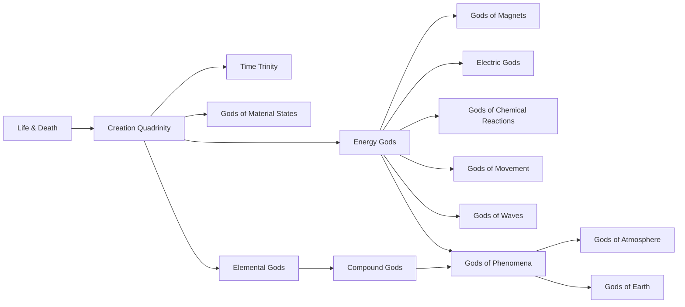
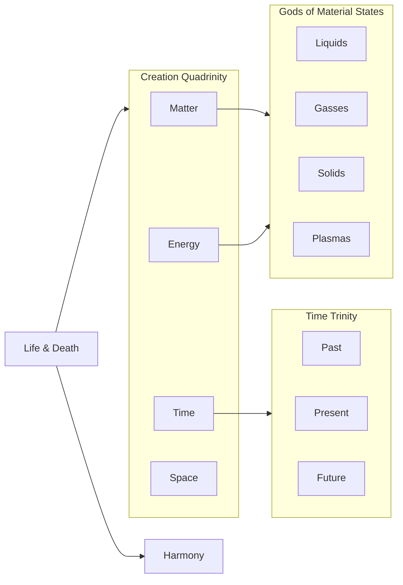

[[Encyclopedia Mysenvaria/Biology/Sophonts/Gods|Gods]] are natural phenomena given form and are created through a process known as [[Encyclopedia Mysenvaria/Culture/Sciences & Technologies/Scientific Theories & Laws/Natural Subdivision|natural subdivision]]. This page serves to document the natural lineage of Gods, information on this page has been derived by [[Encyclopedia Mysenvaria/Culture/Occupations & Crafts/Historian|historians]] using [[Encyclopedia Mysenvaria/Geography/Stars|stars]]. [[Encyclopedia Mysenvaria/History/Biographies/Gods/Gods of Life and Death|Life and Death]] always serve as the first two Gods, being responsible for the creation of all other Gods.
# Overview
This graph gives a general overview of the Godly lineage, showing what groups of Gods are connected to other groups.


# Group Lineages
These graphs serve to show the lineages of specific taxonomical groups of Gods.
## [[Encyclopedia Mysenvaria/Indexes/History/Biographies/Gods/List of Higher-Gods|Higher-Gods]]

## [[Encyclopedia Mysenvaria/Indexes/History/Biographies/Gods/List of Compound Gods|Compound Gods]]

```mermaid
flowchart LR
 subgraph ElementalGods[Elemental Gods]
 direction LR
 Actinium
 Aluminium
 Americium
 Antimony
 Argon
 Arsenic
 Astatine
 Barium
 Berkelium
 Beryllium
 Bismuth
 Bohrium
 Boron
 Bromine
 Cadmium
 Caesium
 Calcium
 Californium
 Carbon
 Cerium
 Chlorine
 Chromium
 Cobalt
 Copernicium
 Copper
 Curium
 Darmstadtium
 Dubnium
 Dysprosium
 Einsteinium
 Erbium
 Europium
 Fermium
 Flerovium
 Fluroine
 Francium
 Gadolinium
 Gallium
 Germanium
 Gold
 Hafnium
 Hassium
 Helium
 Holmium
 Hydrogen
 Indium
 Iodine
 Iridium
 Iron
 Krypton
 Lanthanum
 Lawrencium
 Lead
 Lithium
 Livermorium
 Lutetium
 Magnesium
 Manganese
 Meitnerium
 Mendelevium
 Mercury
 Molybdenum
 Moscovium
 Neodynium
 Neon
 Neptunium
 Nickel
 Nihonium
 Nioblum
 Nitrogen
 Nobelium
 Oganesson
 Osmium
 Oxygen
 Palladium
 Phosphorous
 Platinum
 Plutonium
 Polonium
 Potassium
 Praseodynium
 Promethium
 Protactinium
 Radium
 Radon
 Rhenium
 Rhodium
 Roentgenium
 Rubidium
 Ruthenium
 Rutherfordium
 Samarium
 Scandium
 Seaborgium
 Selenium
 Silicon
 Silver
 Sodium
 Strontium
 Sulfur
 Tantalum
 Technetium
 Tellurium
 Tennessine
 Terbium
 Thallium
 Thorium
 Thulium
 Tin
 Titanium
 Tungsten
 Uranium
 Vandium
 Xenon
 Ytterbium
 Yttrium
 Zinc
 Zirconium
 end
Oxygen --> Retinol
Carbon --> Retinol
Hydrogen --> Retinol
Oxygen --> Rutoside
Carbon --> Rutoside
Hydrogen --> Rutoside
Oxygen --> Cholecalciferol
Carbon --> Cholecalciferol
Hydrogen --> Cholecalciferol
Oxygen --> Ethanol
Carbon --> Ethanol
Hydrogen --> Ethanol
Oxygen --> Glycerol
Carbon --> Glycerol
Hydrogen --> Glycerol
Oxygen --> Aspirin
Carbon --> Aspirin
Hydrogen --> Aspirin
Oxygen --> NicotinicAcid
Nitrogen --> NicotinicAcid
Carbon --> NicotinicAcid
Hydrogen --> NicotinicAcid
Sodium --> SodiumHydroxide
Oxygen --> SodiumHydroxide
Hydrogen --> SodiumHydroxide
Nitrogen --> Tetrahydropyridine
Carbon --> Tetrahydropyridine
Hydrogen --> Tetrahydropyridine
Oxygen --> Phytonadione
Carbon --> Phytonadione
Hydrogen --> Phytonadione
Oxygen --> AscorbicAcid
Carbon --> AscorbicAcid
Hydrogen --> AscorbicAcid
Oxygen --> Trioxidane
Hydrogen --> Trioxidane
Oxygen --> Cyclopentadecanolide
Carbon --> Cyclopentadecanolide
Hydrogen --> Cyclopentadecanolide
Oxygen --> Dicumarol
Carbon --> Dicumarol
Hydrogen --> Dicumarol
Oxygen --> FolicAcid
Nitrogen --> FolicAcid
Carbon --> FolicAcid
Hydrogen --> FolicAcid
Oxygen --> AsparticAcid
Nitrogen --> AsparticAcid
Carbon --> AsparticAcid
Hydrogen --> AsparticAcid
Oxygen --> AminobenzoicAcid
Nitrogen --> AminobenzoicAcid
Carbon --> AminobenzoicAcid
Hydrogen --> AminobenzoicAcid
Oxygen --> MalonicAcid
Carbon --> MalonicAcid
Hydrogen --> MalonicAcid
Phosphorus --> DiammoniumPhosphate
Oxygen --> DiammoniumPhosphate
Nitrogen --> DiammoniumPhosphate
Hydrogen --> DiammoniumPhosphate
Oxygen --> Rocaltrol
Carbon --> Rocaltrol
Hydrogen --> Rocaltrol
Calcium --> CalciumChloride
Chlorine --> CalciumChloride
Oxygen --> AmmoniumNitrate
Nitrogen --> AmmoniumNitrate
Hydrogen --> AmmoniumNitrate
Oxygen --> HydrogenPeroxide
Hydrogen --> HydrogenPeroxide
Oxygen --> NitricOxide
Nitrogen --> NitricOxide
Oxygen --> Isotretinoin
Carbon --> Isotretinoin
Hydrogen --> Isotretinoin
Oxygen --> Urea
Nitrogen --> Urea
Carbon --> Urea
Hydrogen --> Urea
Oxygen --> Warfarin
Carbon --> Warfarin
Hydrogen --> Warfarin
Potassium --> PotassiumCyanide
Nitrogen --> PotassiumCyanide
Carbon --> PotassiumCyanide
Oxygen --> Phenylalanine
Nitrogen --> Phenylalanine
Carbon --> Phenylalanine
Hydrogen --> Phenylalanine
Oxygen --> Alitretinoin
Carbon --> Alitretinoin
Hydrogen --> Alitretinoin
Oxygen --> Phenolphthalein
Carbon --> Phenolphthalein
Hydrogen --> Phenolphthalein
Sulfur --> SodiumSulfate
Sodium --> SodiumSulfate
Oxygen --> SodiumSulfate
Oxygen --> Sucrose
Carbon --> Sucrose
Hydrogen --> Sucrose
Chlorine --> ThionylChloride
Sulfur --> ThionylChloride
Oxygen --> ThionylChloride
Oxygen --> AnthranilicAcid
Nitrogen --> AnthranilicAcid
Carbon --> AnthranilicAcid
Hydrogen --> AnthranilicAcid
Nitrogen --> HydrogenCyanide
Carbon --> HydrogenCyanide
Hydrogen --> HydrogenCyanide
Oxygen --> Caffeine
Nitrogen --> Caffeine
Carbon --> Caffeine
Hydrogen --> Caffeine
Calcium --> CalciumHydroxide
Oxygen --> CalciumHydroxide
Hydrogen --> CalciumHydroxide
Oxygen --> CarbonMonoxide
Carbon --> CarbonMonoxide
Oxygen --> Allantoin
Nitrogen --> Allantoin
Carbon --> Allantoin
Hydrogen --> Allantoin
Calcium --> CalciumOxide
Oxygen --> CalciumOxide
Sulfur --> SodiumEthylXanthate
Sodium --> SodiumEthylXanthate
Oxygen --> SodiumEthylXanthate
Carbon --> SodiumEthylXanthate
Hydrogen --> SodiumEthylXanthate
Oxygen --> Levocarnitine
Nitrogen --> Levocarnitine
Carbon --> Levocarnitine
Hydrogen --> Levocarnitine
Oxygen --> NitrousOxide
Nitrogen --> NitrousOxide
Sodium --> SodiumCarbonate
Oxygen --> SodiumCarbonate
Carbon --> SodiumCarbonate
Oxygen --> CarbonDioxide
Carbon --> CarbonDioxide
Oxygen --> Hyperol
Nitrogen --> Hyperol
Carbon --> Hyperol
Hydrogen --> Hyperol
Oxygen --> LinolenicAcid
Carbon --> LinolenicAcid
Hydrogen --> LinolenicAcid
Silicon --> SiliconDioxide
Oxygen --> SiliconDioxide
Sulfur --> SodiumSulfide
Sodium --> SodiumSulfide
Hydrogen --> SodiumSulfide
Cobalt --> Cyanocobalamin
Phosphorus --> Cyanocobalamin
Oxygen --> Cyanocobalamin
Nitrogen --> Cyanocobalamin
Carbon --> Cyanocobalamin
Hydrogen --> Cyanocobalamin
Oxygen --> Glucose
Carbon --> Glucose
Hydrogen --> Glucose
Oxygen --> SalicylicAcid
Carbon --> SalicylicAcid
Hydrogen --> SalicylicAcid
Oxygen --> Menadione
Carbon --> Menadione
Hydrogen --> Menadione
Oxygen --> RetinoicAcid
Carbon --> RetinoicAcid
Hydrogen --> RetinoicAcid
Chlorine --> BenzethoniumChloride
Oxygen --> BenzethoniumChloride
Nitrogen --> BenzethoniumChloride
Carbon --> BenzethoniumChloride
Hydrogen --> BenzethoniumChloride
Calcium --> CalciumNitrate
Oxygen --> CalciumNitrate
Nitrogen --> CalciumNitrate
Oxygen --> LinoleicAcid
Carbon --> LinoleicAcid
Hydrogen --> LinoleicAcid
Chlorine --> Triclosan
Oxygen --> Triclosan
Carbon --> Triclosan
Hydrogen --> Triclosan
Chlorine --> DatelliptiumChloride
Oxygen --> DatelliptiumChloride
Nitrogen --> DatelliptiumChloride
Carbon --> DatelliptiumChloride
Hydrogen --> DatelliptiumChloride
Oxygen --> Penguinone
Carbon --> Penguinone
Hydrogen --> Penguinone
Oxygen --> Hydroquinone
Carbon --> Hydroquinone
Hydrogen --> Hydroquinone
Oxygen --> UndecylenicAcid
Carbon --> UndecylenicAcid
Hydrogen --> UndecylenicAcid
Sulfur --> Thiamine
Oxygen --> Thiamine
Nitrogen --> Thiamine
Carbon --> Thiamine
Hydrogen --> Thiamine
Calcium --> CalciumAcetate
Oxygen --> CalciumAcetate
Carbon --> CalciumAcetate
Hydrogen --> CalciumAcetate
Oxygen --> Thymolphthalein
Carbon --> Thymolphthalein
Hydrogen --> Thymolphthalein
Sulfur --> MagnesiumSulfate
Magnesium --> MagnesiumSulfate
Oxygen --> MagnesiumSulfate
Carbon --> Beta-carotene
Hydrogen --> Beta-carotene
Oxygen --> PantothenicAcid
Nitrogen --> PantothenicAcid
Carbon --> PantothenicAcid
Hydrogen --> PantothenicAcid
Oxygen --> Calcifediol
Carbon --> Calcifediol
Hydrogen --> Calcifediol
Oxygen --> Water
Hydrogen --> Water
Potassium --> PotassiumNitrate
Oxygen --> PotassiumNitrate
Nitrogen --> PotassiumNitrate
Oxygen --> NitrogenDioxide
Nitrogen --> NitrogenDioxide
Calcium --> CalciumCarbonate
Oxygen --> CalciumCarbonate
Carbon --> CalciumCarbonate
Oxygen --> Nicotinamide
Nitrogen --> Nicotinamide
Carbon --> Nicotinamide
Hydrogen --> Nicotinamide
Nitrogen --> Nicotine
Carbon --> Nicotine
Hydrogen --> Nicotine
Sulfur --> Biotin
Oxygen --> Biotin
Nitrogen --> Biotin
Carbon --> Biotin
Hydrogen --> Biotin
Oxygen --> Calciferol
Carbon --> Calciferol
Hydrogen --> Calciferol
Potassium --> PotassiumCarbonate
Oxygen --> PotassiumCarbonate
Carbon --> PotassiumCarbonate
Oxygen --> Imatinib
Nitrogen --> Imatinib
Carbon --> Imatinib
Hydrogen --> Imatinib
Phosphorus --> AdenylicAcid
Oxygen --> AdenylicAcid
Nitrogen --> AdenylicAcid
Carbon --> AdenylicAcid
Hydrogen --> AdenylicAcid
Oxygen --> Riboflavin
Nitrogen --> Riboflavin
Carbon --> Riboflavin
Hydrogen --> Riboflavin
Oxygen --> DinitrogenTetroxide
Nitrogen --> DinitrogenTetroxide
Oxygen --> Ozone
Oxygen --> MandelonitrileBeta-glucuronide
Nitrogen --> MandelonitrileBeta-glucuronide
Carbon --> MandelonitrileBeta-glucuronide
Hydrogen --> MandelonitrileBeta-glucuronide
Iodine --> CadmiumIodide
Cadmium --> CadmiumIodide
Sulfur --> CarbonDisulfide
Carbon --> CarbonDisulfide
Chlorine --> Atrazine
Nitrogen --> Atrazine
Carbon --> Atrazine
Hydrogen --> Atrazine
Chlorine --> ThiamineChloride
Sulfur --> ThiamineChloride
Oxygen --> ThiamineChloride
Nitrogen --> ThiamineChloride
Carbon --> ThiamineChloride
Hydrogen --> ThiamineChloride
Oxygen --> NitricAcid
Nitrogen --> NitricAcid
Hydrogen --> NitricAcid
Zinc --> ZincChloride
Chlorine --> ZincChloride
 subgraph CompoundGods[Compound Gods]
 direction LR
 AdenylicAcid[Adenylic Acid]
 Alitretinoin
 Allantoin
 AminobenzoicAcid[Aminobenzoic Acid]
 AmmoniumNitrate[Ammonium Nitrate]
 AnthranilicAcid[Anthranilic Acid]
 AscorbicAcid[Ascorbic Acid]
 AsparticAcid[Aspartic Acid]
 Aspirin
 Atrazine
 BenzethoniumChloride[Benzethonium Chloride]
 Beta-carotene
 Biotin
 CadmiumIodide[Cadmium Iodide]
 Caffeine
 Calcifediol
 Calciferol
 CalciumAcetate[Calcium Acetate]
 CalciumCarbonate[Calcium Carbonate]
 CalciumChloride[Calcium Chloride]
 CalciumHydroxide[Calcium Hydroxide]
 CalciumNitrate[Calcium Nitrate]
 CalciumOxide[Calcium Oxide]
 CarbonDioxide[Carbon Dioxide]
 CarbonDisulfide[Carbon Disulfide]
 CarbonMonoxide[Carbon Monoxide]
 Cholecalciferol
 Cyanocobalamin
 Cyclopentadecanolide
 DatelliptiumChloride[Datelliptium Chloride]
 DiammoniumPhosphate[Diammonium Phosphate]
 Dicumarol
 DinitrogenTetroxide[Dinitrogen Tetroxide]
 Ethanol
 FolicAcid[Folic Acid]
 Glucose
 Glycerol
 HydrogenCyanide[Hydrogen Cyanide]
 HydrogenPeroxide[Hydrogen Peroxide]
 Hydroquinone
 Hyperol
 Imatinib
 Isotretinoin
 Levocarnitine
 LinoleicAcid[Linoleic Acid]
 LinolenicAcid[Linolenic Acid]
 MagnesiumSulfate[Magnesium Sulfate]
 MalonicAcid[Malonic Acid]
 MandelonitrileBeta-glucuronide[Mandelonitrile Beta-glucuronide]
 Menadione
 Nicotinamide
 Nicotine
 NicotinicAcid[Nicotinic Acid]
 NitricAcid[Nitric Acid]
 NitricOxide[Nitric Oxide]
 NitrogenDioxide[Nitrogen Dioxide]
 NitrousOxide[Nitrous Oxide]
 Ozone
 PantothenicAcid[Pantothenic Acid]
 Penguinone
 Phenolphthalein
 Phenylalanine
 Phytonadione
 PotassiumCarbonate[Potassium Carbonate]
 PotassiumCyanide[Potassium Cyanide]
 PotassiumNitrate[Potassium Nitrate]
 RetinoicAcid[Retinoic Acid]
 Retinol
 Riboflavin
 Rocaltrol
 Rutoside
 SalicylicAcid[Salicylic Acid]
 SiliconDioxide[Silicon Dioxide]
 SodiumCarbonate[Sodium Carbonate]
 SodiumEthylXanthate[Sodium Ethyl Xanthate]
 SodiumHydroxide[Sodium Hydroxide]
 SodiumSulfate[Sodium Sulfate]
 SodiumSulfide[Sodium Sulfide]
 Sucrose
 Tetrahydropyridine
 Thiamine
 ThiamineChloride[Thiamine Chloride]
 ThionylChloride[Thionyl Chloride]
 Thymolphthalein
 Triclosan
 Trioxidane
 UndecylenicAcid[Undecylenic Acid]
 Urea
 Warfarin
 Water
 ZincChloride[Zinc Chloride]
 end
```

## [[Encyclopedia Mysenvaria/Indexes/History/Biographies/Gods/List of Energy Gods|Energy Gods]]

## Phenomena Gods
# Complete Graph
This graph shows all connections between the creation of all Gods.
```mermaid
flowchart LR
LifeDeath[Life & Death]-->CreationQuadrinity
LifeDeath-->Harmony
Harmony-->Chaos
 subgraph CreationQuadrinity[Creation Quadrinity]
 direction LR
 Matter
 Energy
 Time
 Space
 end
Time-->TimeGods
 subgraph TimeGods[Time Trinity]
 direction LR
 Past
 Present
 Future
 end
Matter-->MaterialStateGods
Energy-->MaterialStateGods
 subgraph MaterialStateGods[Gods of Material States]
 direction LR
 Liquids
 Gasses
 Solids
 Plasmas
 end
Matter-->KineticEnergy
Matter-->PotentialEnergy
Energy-->KineticEnergy
Energy-->PotentialEnergy
 subgraph EnergyGods[Energy Gods]
 direction LR
 KineticEnergy[Kinetic Energy]
 KineticEnergy-->MechanicalEnergy[Mechanical Energy]
 MechanicalEnergy-->Motion
 MechanicalEnergy-->ElasticEnergy[Elastic Energy]
 KineticEnergy-->ThermalEnergy[Thermal Energy]
 ThermalEnergy-->Heat
 ThermalEnergy-->Cold
 PotentialEnergy[Potential Energy]
 PotentialEnergy-->MechanicalEnergy
 PotentialEnergy-->ElectricEnergy[Electric Energy]
 PotentialEnergy-->MagneticEnergy[Magnetic Energy]
 PotentialEnergy-->GravitationalEnergy[Gravitational Energy]
 PotentialEnergy-->ChemicalEnergy[Chemical Energy]
 ChemicalEnergy-->Bond
 ChemicalEnergy-->Combustion
 ChemicalEnergy-->Activation
 PotentialEnergy-->IonizingEnergy[Ionizing Energy]
 PotentialEnergy-->NuclearEnergy[Nuclear Energy]
 NuclearEnergy-->RadioactiveDecay[Radioactive Decay]
 NuclearEnergy-->Fission
 NuclearEnergy-->Fusion
 PotentialEnergy-->ChromodynamicEnergy[Chromodynamic Energy]
 PotentialEnergy-->ElasticEnergy
 ElasticEnergy-->Deformation
 PotentialEnergy-->RadiantEnergy[Radiant Energy]
 PotentialEnergy-->Rest
 MagneticEnergy-->MagneticGods
  subgraph MagneticGods[Gods of Magnets]
  direction LR
  Diamagnetism
  Paramagnetism
  Ferromagnetism
  Antiferromagnetism
  Ferrimagnetism
  end
 ElectricEnergy-->Electric
  subgraph Electric[Electric Gods]
  direction LR
  Current
  Voltage
  Static
  Conductivity
  Resistance
  end
 Activation-->ChemicalReactions
 Bond-->ChemicalReactions
 Combustion-->ChemicalReactions
  subgraph ReactionGods[Gods of Chemical Reactions]
  direction LR
  ChemicalReactions[Chemical Reactions]
  ChemicalReactions-->EndothermicReactions[Endothermic Reactions]
  ChemicalReactions-->ExothermicReactions[Exothermic Reactions]
  ChemicalReactions-->Acids
  Acids-->StrongAcids[Strong Acids]
  Acids-->WeakAcids[Weak Acids]
  ChemicalReactions-->Bases
  Bases-->StrongBases[Strong Bases]
  Bases-->WeakBases[Weak Bases]
  end
 Motion-->Movement
 GravitationalEnergy-->GravitationalMotion
  subgraph Movement[Gods of Movement]
  direction LR
  Friction
  LinearMotion[Linear Motion]
  RotationalMotion[Rotational Motion]
  RotationalMotion-->Oscillation
  GravitationalMotion[Gravitational Motion]
  GravitationalMotion-->OrbitalMotion[Orbital Motion]
  end
 MechanicalEnergy-->Wave
 LinearMotion-->Wave
  subgraph Waves[Gods of Waves]
  direction LR
  Wave[Mechanical Waves]
  Wave-->WaveHarmony[Wave Harmony]
  Wave-->WaveDissonance[Wave Dissonance]
  Wave-->WaveResonance[Wave Resonance]
  Wave-->WaveAbsorption[Wave Absorption]
  Wave-->WaveRefraction[Wave Refraction]
  Wave-->WaveDiffraction[Wave Diffraction]
  Wave-->WaveConsonance[Wave Consonance]
  end
 end
Matter-->ElementalGods
 subgraph ElementalGods[Elemental Gods]
 direction LR
 Actinium
 Aluminium
 Americium
 Antimony
 Argon
 Arsenic
 Astatine
 Barium
 Berkelium
 Beryllium
 Bismuth
 Bohrium
 Boron
 Bromine
 Cadmium
 Caesium
 Calcium
 Californium
 Carbon
 Cerium
 Chlorine
 Chromium
 Cobalt
 Copernicium
 Copper
 Curium
 Darmstadtium
 Dubnium
 Dysprosium
 Einsteinium
 Erbium
 Europium
 Fermium
 Flerovium
 Fluroine
 Francium
 Gadolinium
 Gallium
 Germanium
 Gold
 Hafnium
 Hassium
 Helium
 Holmium
 Hydrogen
 Indium
 Iodine
 Iridium
 Iron
 Krypton
 Lanthanum
 Lawrencium
 Lead
 Lithium
 Livermorium
 Lutetium
 Magnesium
 Manganese
 Meitnerium
 Mendelevium
 Mercury
 Molybdenum
 Moscovium
 Neodynium
 Neon
 Neptunium
 Nickel
 Nihonium
 Nioblum
 Nitrogen
 Nobelium
 Oganesson
 Osmium
 Oxygen
 Palladium
 Phosphorous
 Platinum
 Plutonium
 Polonium
 Potassium
 Praseodynium
 Promethium
 Protactinium
 Radium
 Radon
 Rhenium
 Rhodium
 Roentgenium
 Rubidium
 Ruthenium
 Rutherfordium
 Samarium
 Scandium
 Seaborgium
 Selenium
 Silicon
 Silver
 Sodium
 Strontium
 Sulfur
 Tantalum
 Technetium
 Tellurium
 Tennessine
 Terbium
 Thallium
 Thorium
 Thulium
 Tin
 Titanium
 Tungsten
 Uranium
 Vandium
 Xenon
 Ytterbium
 Yttrium
 Zinc
 Zirconium
 end
Solids-->Rock
ElementalGods-->Rock
Rock-->Magma
Liquids-->Magma
Heat-->Magma
Rock-->Tectonics
Magma-->Tectonics
Liquids-->Atmosphere
Gasses-->Atmosphere
ElementalGods-->Atmosphere
Atmosphere-->UpperAtmosphere
Atmosphere-->LowerAtmosphere
UpperAtmosphere-->Weather
Water-->Weather
Weather-->Rain
ElementalGods-->AcidRain
Rain-->AcidRain
Plasmas-->Lightning
Weather-->Lightning
Static-->Lightning
Lightning-->Thunder
Lightning-->BallLightning
Lightning-->BeadLightning
Lightning-->HeatLightning
Friction-->HeatLightning
Wave-->Thunder
Magma-->IgneousRock
IgneousRock-->MetamorphicRock
Tectonics-->MetamorphicRock
Tectonics-->Earthquake
IgneousRock-->SedimentaryRock
Weather-->Weathering
Rock-->Weathering
Atmosphere-->Moisture
Rain-->Snow
Cold-->Snow
UpperAtmosphere-->Clouds
Rain-->Hail
Rock-->Hail
Clouds-->Rain
Clouds-->Wind
Clouds-->Fog
LowerAtmosphere-->Fog
LowerAtmosphere-->Tornadoes
Wind-->Tornadoes
UpperAtmosphere-->AirPressure
LowerAtmosphere-->AirPressure
Wind-->Downburst
UpperAtmosphere-->JetStreams
Wind-->JetStreams
Weather-->DustStorm
Sand-->DustStorm
IgneousRock-->ExtrusiveRock
IgneousRock-->IntrusiveRock
Weathering-->SedimentaryRock
SedimentaryRock-->Sand
Weathering-->Sand
SedimentaryRock-->Clay
Weathering-->Clay
SedimentaryRock-->Silt
Weathering-->Silt
SedimentaryRock-->Gravel
Weathering-->Gravel
Rock-->Crystallization
MetamorphicRock-->Recrystallization
Crystallization-->Recrystallization
 subgraph Phenomena[Gods of Phenomena]
 direction LR
  subgraph Atmospheric[Gods of Atmosphere]
  direction LR
  Atmosphere
  LowerAtmosphere[Lower Atmosphere]
  UpperAtmosphere[Upper Atmosphere]
  Weather
  Lightning
  Thunder
  BallLightning[Ball Lightning]
  BeadLightning[Bead Lightning]
  HeatLightning[Heat Lightning]
  Rain
  AcidRain[Acid Rain]
  Moisture
  Snow
  Tornadoes
  Wind
  AirPressure[Air Pressure]
  Clouds
  Downburst
  DustStorm[Dust Storm]
  Fog
  Hail
  JetStreams[Jet Streams]
  end
  subgraph Earth[Gods of Earth]
  direction LR
  Rock
  Magma
  Tectonics
  IgneousRock[Igneous Rock]
  IntrusiveRock[Intrusive Rock]
  ExtrusiveRock[Extrusive Rock]
  MetamorphicRock[Metamorphic Rock]
  SedimentaryRock[Sedimentary Rock]
  Crystallization
  Recrystallization
  Weathering
  Sand
  Clay
  Silt
  Gravel
  Earthquake
  end
 end
Oxygen --> Retinol
Carbon --> Retinol
Hydrogen --> Retinol
Oxygen --> Rutoside
Carbon --> Rutoside
Hydrogen --> Rutoside
Oxygen --> Cholecalciferol
Carbon --> Cholecalciferol
Hydrogen --> Cholecalciferol
Oxygen --> Ethanol
Carbon --> Ethanol
Hydrogen --> Ethanol
Oxygen --> Glycerol
Carbon --> Glycerol
Hydrogen --> Glycerol
Oxygen --> Aspirin
Carbon --> Aspirin
Hydrogen --> Aspirin
Oxygen --> NicotinicAcid
Nitrogen --> NicotinicAcid
Carbon --> NicotinicAcid
Hydrogen --> NicotinicAcid
Sodium --> SodiumHydroxide
Oxygen --> SodiumHydroxide
Hydrogen --> SodiumHydroxide
Nitrogen --> Tetrahydropyridine
Carbon --> Tetrahydropyridine
Hydrogen --> Tetrahydropyridine
Oxygen --> Phytonadione
Carbon --> Phytonadione
Hydrogen --> Phytonadione
Oxygen --> AscorbicAcid
Carbon --> AscorbicAcid
Hydrogen --> AscorbicAcid
Oxygen --> Trioxidane
Hydrogen --> Trioxidane
Oxygen --> Cyclopentadecanolide
Carbon --> Cyclopentadecanolide
Hydrogen --> Cyclopentadecanolide
Oxygen --> Dicumarol
Carbon --> Dicumarol
Hydrogen --> Dicumarol
Oxygen --> FolicAcid
Nitrogen --> FolicAcid
Carbon --> FolicAcid
Hydrogen --> FolicAcid
Oxygen --> AsparticAcid
Nitrogen --> AsparticAcid
Carbon --> AsparticAcid
Hydrogen --> AsparticAcid
Oxygen --> AminobenzoicAcid
Nitrogen --> AminobenzoicAcid
Carbon --> AminobenzoicAcid
Hydrogen --> AminobenzoicAcid
Oxygen --> MalonicAcid
Carbon --> MalonicAcid
Hydrogen --> MalonicAcid
Phosphorus --> DiammoniumPhosphate
Oxygen --> DiammoniumPhosphate
Nitrogen --> DiammoniumPhosphate
Hydrogen --> DiammoniumPhosphate
Oxygen --> Rocaltrol
Carbon --> Rocaltrol
Hydrogen --> Rocaltrol
Calcium --> CalciumChloride
Chlorine --> CalciumChloride
Oxygen --> AmmoniumNitrate
Nitrogen --> AmmoniumNitrate
Hydrogen --> AmmoniumNitrate
Oxygen --> HydrogenPeroxide
Hydrogen --> HydrogenPeroxide
Oxygen --> NitricOxide
Nitrogen --> NitricOxide
Oxygen --> Isotretinoin
Carbon --> Isotretinoin
Hydrogen --> Isotretinoin
Oxygen --> Urea
Nitrogen --> Urea
Carbon --> Urea
Hydrogen --> Urea
Oxygen --> Warfarin
Carbon --> Warfarin
Hydrogen --> Warfarin
Potassium --> PotassiumCyanide
Nitrogen --> PotassiumCyanide
Carbon --> PotassiumCyanide
Oxygen --> Phenylalanine
Nitrogen --> Phenylalanine
Carbon --> Phenylalanine
Hydrogen --> Phenylalanine
Oxygen --> Alitretinoin
Carbon --> Alitretinoin
Hydrogen --> Alitretinoin
Oxygen --> Phenolphthalein
Carbon --> Phenolphthalein
Hydrogen --> Phenolphthalein
Sulfur --> SodiumSulfate
Sodium --> SodiumSulfate
Oxygen --> SodiumSulfate
Oxygen --> Sucrose
Carbon --> Sucrose
Hydrogen --> Sucrose
Chlorine --> ThionylChloride
Sulfur --> ThionylChloride
Oxygen --> ThionylChloride
Oxygen --> AnthranilicAcid
Nitrogen --> AnthranilicAcid
Carbon --> AnthranilicAcid
Hydrogen --> AnthranilicAcid
Nitrogen --> HydrogenCyanide
Carbon --> HydrogenCyanide
Hydrogen --> HydrogenCyanide
Oxygen --> Caffeine
Nitrogen --> Caffeine
Carbon --> Caffeine
Hydrogen --> Caffeine
Calcium --> CalciumHydroxide
Oxygen --> CalciumHydroxide
Hydrogen --> CalciumHydroxide
Oxygen --> CarbonMonoxide
Carbon --> CarbonMonoxide
Oxygen --> Allantoin
Nitrogen --> Allantoin
Carbon --> Allantoin
Hydrogen --> Allantoin
Calcium --> CalciumOxide
Oxygen --> CalciumOxide
Sulfur --> SodiumEthylXanthate
Sodium --> SodiumEthylXanthate
Oxygen --> SodiumEthylXanthate
Carbon --> SodiumEthylXanthate
Hydrogen --> SodiumEthylXanthate
Oxygen --> Levocarnitine
Nitrogen --> Levocarnitine
Carbon --> Levocarnitine
Hydrogen --> Levocarnitine
Oxygen --> NitrousOxide
Nitrogen --> NitrousOxide
Sodium --> SodiumCarbonate
Oxygen --> SodiumCarbonate
Carbon --> SodiumCarbonate
Oxygen --> CarbonDioxide
Carbon --> CarbonDioxide
Oxygen --> Hyperol
Nitrogen --> Hyperol
Carbon --> Hyperol
Hydrogen --> Hyperol
Oxygen --> LinolenicAcid
Carbon --> LinolenicAcid
Hydrogen --> LinolenicAcid
Silicon --> SiliconDioxide
Oxygen --> SiliconDioxide
Sulfur --> SodiumSulfide
Sodium --> SodiumSulfide
Hydrogen --> SodiumSulfide
Cobalt --> Cyanocobalamin
Phosphorus --> Cyanocobalamin
Oxygen --> Cyanocobalamin
Nitrogen --> Cyanocobalamin
Carbon --> Cyanocobalamin
Hydrogen --> Cyanocobalamin
Oxygen --> Glucose
Carbon --> Glucose
Hydrogen --> Glucose
Oxygen --> SalicylicAcid
Carbon --> SalicylicAcid
Hydrogen --> SalicylicAcid
Oxygen --> Menadione
Carbon --> Menadione
Hydrogen --> Menadione
Oxygen --> RetinoicAcid
Carbon --> RetinoicAcid
Hydrogen --> RetinoicAcid
Chlorine --> BenzethoniumChloride
Oxygen --> BenzethoniumChloride
Nitrogen --> BenzethoniumChloride
Carbon --> BenzethoniumChloride
Hydrogen --> BenzethoniumChloride
Calcium --> CalciumNitrate
Oxygen --> CalciumNitrate
Nitrogen --> CalciumNitrate
Oxygen --> LinoleicAcid
Carbon --> LinoleicAcid
Hydrogen --> LinoleicAcid
Chlorine --> Triclosan
Oxygen --> Triclosan
Carbon --> Triclosan
Hydrogen --> Triclosan
Chlorine --> DatelliptiumChloride
Oxygen --> DatelliptiumChloride
Nitrogen --> DatelliptiumChloride
Carbon --> DatelliptiumChloride
Hydrogen --> DatelliptiumChloride
Oxygen --> Penguinone
Carbon --> Penguinone
Hydrogen --> Penguinone
Oxygen --> Hydroquinone
Carbon --> Hydroquinone
Hydrogen --> Hydroquinone
Oxygen --> UndecylenicAcid
Carbon --> UndecylenicAcid
Hydrogen --> UndecylenicAcid
Sulfur --> Thiamine
Oxygen --> Thiamine
Nitrogen --> Thiamine
Carbon --> Thiamine
Hydrogen --> Thiamine
Calcium --> CalciumAcetate
Oxygen --> CalciumAcetate
Carbon --> CalciumAcetate
Hydrogen --> CalciumAcetate
Oxygen --> Thymolphthalein
Carbon --> Thymolphthalein
Hydrogen --> Thymolphthalein
Sulfur --> MagnesiumSulfate
Magnesium --> MagnesiumSulfate
Oxygen --> MagnesiumSulfate
Carbon --> Beta-carotene
Hydrogen --> Beta-carotene
Oxygen --> PantothenicAcid
Nitrogen --> PantothenicAcid
Carbon --> PantothenicAcid
Hydrogen --> PantothenicAcid
Oxygen --> Calcifediol
Carbon --> Calcifediol
Hydrogen --> Calcifediol
Oxygen --> Water
Hydrogen --> Water
Potassium --> PotassiumNitrate
Oxygen --> PotassiumNitrate
Nitrogen --> PotassiumNitrate
Oxygen --> NitrogenDioxide
Nitrogen --> NitrogenDioxide
Calcium --> CalciumCarbonate
Oxygen --> CalciumCarbonate
Carbon --> CalciumCarbonate
Oxygen --> Nicotinamide
Nitrogen --> Nicotinamide
Carbon --> Nicotinamide
Hydrogen --> Nicotinamide
Nitrogen --> Nicotine
Carbon --> Nicotine
Hydrogen --> Nicotine
Sulfur --> Biotin
Oxygen --> Biotin
Nitrogen --> Biotin
Carbon --> Biotin
Hydrogen --> Biotin
Oxygen --> Calciferol
Carbon --> Calciferol
Hydrogen --> Calciferol
Potassium --> PotassiumCarbonate
Oxygen --> PotassiumCarbonate
Carbon --> PotassiumCarbonate
Oxygen --> Imatinib
Nitrogen --> Imatinib
Carbon --> Imatinib
Hydrogen --> Imatinib
Phosphorus --> AdenylicAcid
Oxygen --> AdenylicAcid
Nitrogen --> AdenylicAcid
Carbon --> AdenylicAcid
Hydrogen --> AdenylicAcid
Oxygen --> Riboflavin
Nitrogen --> Riboflavin
Carbon --> Riboflavin
Hydrogen --> Riboflavin
Oxygen --> DinitrogenTetroxide
Nitrogen --> DinitrogenTetroxide
Oxygen --> Ozone
Oxygen --> MandelonitrileBeta-glucuronide
Nitrogen --> MandelonitrileBeta-glucuronide
Carbon --> MandelonitrileBeta-glucuronide
Hydrogen --> MandelonitrileBeta-glucuronide
Iodine --> CadmiumIodide
Cadmium --> CadmiumIodide
Sulfur --> CarbonDisulfide
Carbon --> CarbonDisulfide
Chlorine --> Atrazine
Nitrogen --> Atrazine
Carbon --> Atrazine
Hydrogen --> Atrazine
Chlorine --> ThiamineChloride
Sulfur --> ThiamineChloride
Oxygen --> ThiamineChloride
Nitrogen --> ThiamineChloride
Carbon --> ThiamineChloride
Hydrogen --> ThiamineChloride
Oxygen --> NitricAcid
Nitrogen --> NitricAcid
Hydrogen --> NitricAcid
Zinc --> ZincChloride
Chlorine --> ZincChloride
 subgraph CompoundGods[Compound Gods]
 direction LR
 AdenylicAcid[Adenylic Acid]
 Alitretinoin
 Allantoin
 AminobenzoicAcid[Aminobenzoic Acid]
 AmmoniumNitrate[Ammonium Nitrate]
 AnthranilicAcid[Anthranilic Acid]
 AscorbicAcid[Ascorbic Acid]
 AsparticAcid[Aspartic Acid]
 Aspirin
 Atrazine
 BenzethoniumChloride[Benzethonium Chloride]
 Beta-carotene
 Biotin
 CadmiumIodide[Cadmium Iodide]
 Caffeine
 Calcifediol
 Calciferol
 CalciumAcetate[Calcium Acetate]
 CalciumCarbonate[Calcium Carbonate]
 CalciumChloride[Calcium Chloride]
 CalciumHydroxide[Calcium Hydroxide]
 CalciumNitrate[Calcium Nitrate]
 CalciumOxide[Calcium Oxide]
 CarbonDioxide[Carbon Dioxide]
 CarbonDisulfide[Carbon Disulfide]
 CarbonMonoxide[Carbon Monoxide]
 Cholecalciferol
 Cyanocobalamin
 Cyclopentadecanolide
 DatelliptiumChloride[Datelliptium Chloride]
 DiammoniumPhosphate[Diammonium Phosphate]
 Dicumarol
 DinitrogenTetroxide[Dinitrogen Tetroxide]
 Ethanol
 FolicAcid[Folic Acid]
 Glucose
 Glycerol
 HydrogenCyanide[Hydrogen Cyanide]
 HydrogenPeroxide[Hydrogen Peroxide]
 Hydroquinone
 Hyperol
 Imatinib
 Isotretinoin
 Levocarnitine
 LinoleicAcid[Linoleic Acid]
 LinolenicAcid[Linolenic Acid]
 MagnesiumSulfate[Magnesium Sulfate]
 MalonicAcid[Malonic Acid]
 MandelonitrileBeta-glucuronide[Mandelonitrile Beta-glucuronide]
 Menadione
 Nicotinamide
 Nicotine
 NicotinicAcid[Nicotinic Acid]
 NitricAcid[Nitric Acid]
 NitricOxide[Nitric Oxide]
 NitrogenDioxide[Nitrogen Dioxide]
 NitrousOxide[Nitrous Oxide]
 Ozone
 PantothenicAcid[Pantothenic Acid]
 Penguinone
 Phenolphthalein
 Phenylalanine
 Phytonadione
 PotassiumCarbonate[Potassium Carbonate]
 PotassiumCyanide[Potassium Cyanide]
 PotassiumNitrate[Potassium Nitrate]
 RetinoicAcid[Retinoic Acid]
 Retinol
 Riboflavin
 Rocaltrol
 Rutoside
 SalicylicAcid[Salicylic Acid]
 SiliconDioxide[Silicon Dioxide]
 SodiumCarbonate[Sodium Carbonate]
 SodiumEthylXanthate[Sodium Ethyl Xanthate]
 SodiumHydroxide[Sodium Hydroxide]
 SodiumSulfate[Sodium Sulfate]
 SodiumSulfide[Sodium Sulfide]
 Sucrose
 Tetrahydropyridine
 Thiamine
 ThiamineChloride[Thiamine Chloride]
 ThionylChloride[Thionyl Chloride]
 Thymolphthalein
 Triclosan
 Trioxidane
 UndecylenicAcid[Undecylenic Acid]
 Urea
 Warfarin
 Water
 ZincChloride[Zinc Chloride]
 end
```
