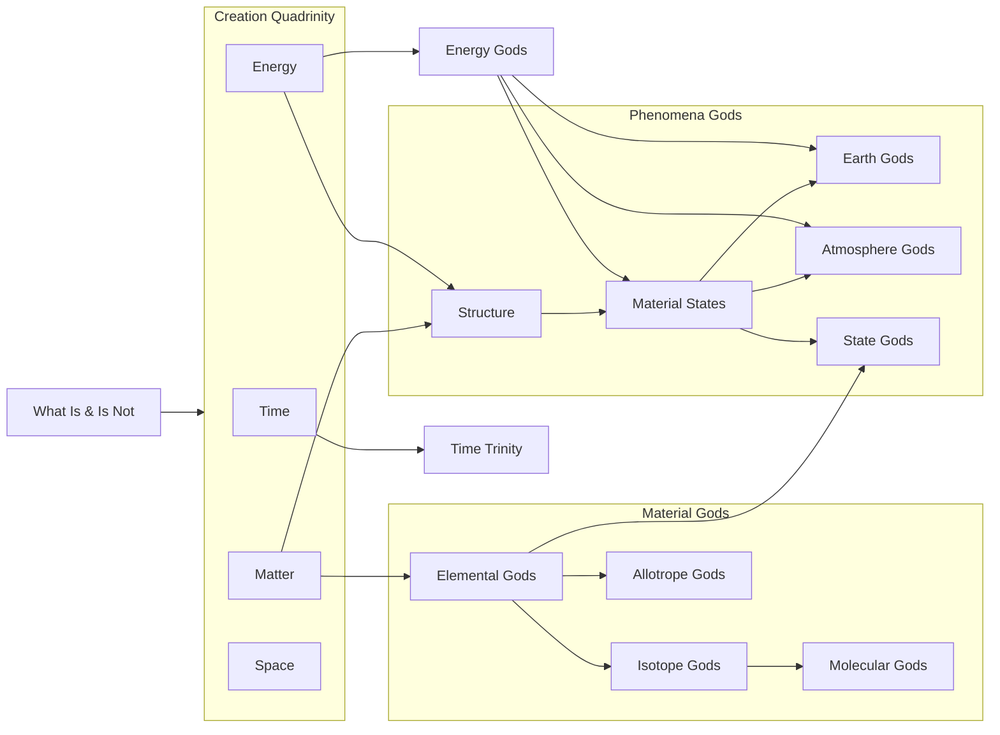

> [!note] [[Meta/Meta|Meta]] || [[Meta/Callouts#Incomplete|Incomplete Article]]
> This article is incomplete! It's currently in the process of being written but contains significant missing information! You can help expand it by commenting or suggesting an edit through [GitHub issues](https://github.com/RagtimeGal/quartz--encyclopedia-mysenvaria/issues/new/choose)!

> [!warning] [[Meta/Meta|Meta]] || [[Meta/Callouts#Names|Names]]
> Some names in this article are placeholders! Until the setting's history is developed further—allowing for languages and the likes to be constructed accurately—temporary names are used for places, people, and things.
> 
> These placeholder names may resemble real people, be simple descriptions, or even appear as random jumbles of letters or numbers.
> 
> The intent is to keep track of these placeholders so that they may be replaced in the future. If you find a name which looks out of place, report it through a [GitHub issue](https://github.com/RagtimeGal/quartz--encyclopedia-mysenvaria/issues/new/choose)!

Godly Lineage Models, or GLMs, are models of the [[Encyclopedia Mysenvaria/Science/Phenomena/Gods|God's]] lineage created and used by [[Encyclopedia Mysenvaria/Science/Branches/Theogenesis|theogenists]] and [[Encyclopedia Mysenvaria/Science/Branches/Astronomy|astronomers]] to classify Gods and help understand various aspects of their relationships and domains. GLMs are similar to traditional [[Encyclopedia Mysenvaria/Science/Models/Lineage|lineage]] models, like those commonly used in [[Encyclopedia Mysenvaria/Science/Branches/Anthropology|anthropology]] and [[Encyclopedia Mysenvaria/Biology/Biology|biology]].

GLMs are modelled based on translations of [[Encyclopedia Mysenvaria/Science/Phenomena/Stars|stars]], in particular those from the [[Encyclopedia Mysenvaria/Geography/Stars/Star Systems/Quickening Star System|Quickening Star System]]. GLMs are divided into two categories depending on the translations used: compilation models, and complete models.

Compilation models are created using the translations of multiple authors, coalesced into one unified model. Complete models are created using the complete translations of a single author. Only a handful of astronomers throughout history have translated the entirety of the Quickening System, and for this reason complete models are rare.

One of the most highly regarded GLMs is the Kaleidoscope Model, a complete model originally organized by [[Encyclopedia Mysenvaria/History/Biographies/Temporary Kaleidoscope|Temporary Kaleidoscope]], however only formally published posthumously in *[[Encyclopedia Mysenvaria/Arts/Useful Arts/Literature/Non-fiction/The Collected Works of Kaleidoscope|The Collected Works of Kaleidoscope]]*. 

The basic structure of GLMs does not vary significantly as the mechanisms by which Gods are created does not vary. All Gods—bar [[Encyclopedia Mysenvaria/History/Biographies/Gods/Gods of What Is and Is Not|What Is and Is Not]]—were created during the [[Encyclopedia Mysenvaria/History/God-War Era/Quickening|Quickening]] via [[Encyclopedia Mysenvaria/Science/Phenomena/Gods#Creation & Domains|domain subdivision]] by one or more Gods. What Is and Is Not are the only Gods known to have been created via [[Encyclopedia Mysenvaria/Science/Phenomena/Natural Personification#Material Concentration|material concentration]], and so always serve as the common ancestor of all Gods.
# Models
## Simplified Model
 

## Kaleidoscope Model
![[Encyclopedia Mysenvaria/Science/Models/Kaleidoscope Lineage Model.canvas]]
