# Prehistory
- 690bt: [[Encyclopedia Mysenvaria/History/Biographies/Gods/Gods of Matter, Energy, Time, and Space|Gods of Matter, Energy, Time, and Space Created]]
- 653bt: [[Encyclopedia Mysenvaria/History/God-War Era/Quickening|The Quickening Begins]]
# [[Encyclopedia Mysenvaria/History/God-War Era/God-War Era|God-War Era]]
- 651bt: [[Encyclopedia Mysenvaria/History/God-War Era/First Death of a God|First God Dies]]
- 587bt: [[Encyclopedia Mysenvaria/Geography/Natural Features/Great Oceanic Crater|Great Oceanic Crater Created]]
- 527bt: [[Encyclopedia Mysenvaria/History/God-War Era/God Councils#First Council|First God Council Held]]
- 523bt: [[Encyclopedia Mysenvaria/Biology/Plant|Plants Created]]
- 476bt: [[Encyclopedia Mysenvaria/Biology/Animals/Organisms of Mass Destruction|Organisms of Mass Destruction Invented]]
- 442bt: [[Encyclopedia Mysenvaria/Biology/Sophonts/Human|Humanity Created]]
- 440bt: [[Encyclopedia Mysenvaria/History/God-War Era/God Councils#Second Council|Second God Council Held]]
- 426bt: [[Encyclopedia Mysenvaria/Biology/Sophonts/Dwarf|Dwarves Created]]
- 421bt: [[Encyclopedia Mysenvaria/Biology/Sophonts/Elf|Elves Created]]
- 419bt: [[Encyclopedia Mysenvaria/Geography/Artificial Features/Sextown|Founding of Sextown]]
- 404bt: [[Encyclopedia Mysenvaria/History/Biographies/Gods/Phenomena Gods/Gods of Earth/God of Tectonics|God of Tectonics Slain]]
- 388bt: [[Encyclopedia Mysenvaria/Biology/Sophonts/Demi-God|First Demi-God Born]], [[Encyclopedia Mysenvaria/History/Biographies/Josh Soundson|Josh Soundson]]
- 386bt: [[Encyclopedia Mysenvaria/History/God-War Era/God Councils#Third Council|Third God Council Held]]
- 337bt: [[Encyclopedia Mysenvaria/History/God-War Era/God Councils#Fourth Council|Fourth God Council Held]]
- 336bt: [[Encyclopedia Mysenvaria/History/God-War Era/Great Flood|World Begins Flooding]]
- 321bt: [[Encyclopedia Mysenvaria/History/God-War Era/Great Flood|World Finishes Flooding]]
- 306bt: [[Encyclopedia Mysenvaria/History/Biographies/First Elven Elder|First Elven Elder Rooted]]
- 286bt: [[Encyclopedia Mysenvaria/Geography/Natural Features/Northern Mountains|Northern Mountains Created]]
- 273bt: [[Encyclopedia Mysenvaria/Biology/Sophonts/Womb-God|First Womb-God Born]], [[Encyclopedia Mysenvaria/History/Biographies/Charles Lightningson|First Womb-God]]
- 272bt: [[Encyclopedia Mysenvaria/History/God-War Era/God Councils#Fifth Council|Fifth God Council Held]]
- 161bt: [[Encyclopedia Mysenvaria/Geography/Natural Features/Eastern Archipelago|Eastern Archipelago Created]]
- 118bt: [[Encyclopedia Mysenvaria/Geography/Natural Features/Southern Crater Scape|Southern Crater Scape Created]]
- 69bt: [[Encyclopedia Mysenvaria/History/Biographies/Josh Soundson|First Demi-God Dies]]
- 65bt: [[Encyclopedia Mysenvaria/History/God-War Era/God Councils#Sixth Council|Sixth God Council Held]]
- 37bt: [[Encyclopedia Mysenvaria/Geography/Natural Features/Great Tear|Great Tear Created]]
- 37bt: [[Encyclopedia Mysenvaria/History/Biographies/First Elven Elder|First Elven Elder Passes]]
- 0bt: [[Encyclopedia Mysenvaria/Geography/Stars/Harmonic Treaty|Harmonic Treaty Signed]]

# [[Encyclopedia Mysenvaria/History/Post-War Era/Post-War Era|Post-War Era]]

# [[Encyclopedia Mysenvaria/History/Golden Age/Golden Age|Golden Age]]

# [[Encyclopedia Mysenvaria/History/Modern Era/Modern Era|Modern Era]]
- 1214at: [[Encyclopedia Mysenvaria/Culture/Sciences & Technologies/Technologies/Printing Press|Printing Press Invented]]
- 1351at: Guns Invented
- 1422at: First Southern Ship Reaches The Northern Continent
- 1496at: Distress Signal Sent

```mermaid
%%{init: { 'logLevel': 'debug', 'theme': 'neutral' } }%%
timeline
    -651 : The God War Era
    0 : Post-War Era
    609 : Golden Era
    1214 : Modern Era
    0 : Harmonic Treaty Signed
    -690 : First Gods Created
    1496 : Distress Signal Sent
    1214 : Printing Press Invented
    -651 : First God Dies
    296 : civil uprest
    920 : lots of inventions
    -273 : End War Epoch
    -523 : Mid War Epoch
    1336 : colonization
    -651 : Early War Epoch
    -523 : Plants Invented
    -273 : First Womb-God Born
    1309 : Guns Invented
    34 : Founding of Eastern Postciv
    42 : Founding of Eastern Mediciv
    18 : Founding of Southern Tearciv
    43 : Founding of Western Mediciv
    68 : Fouding of Jungle Deltown
    64 : Founding of Inner Rainciv
    575 : lots of philosophical and ethical changes in societies
    -523 : Iteration Period
    -527 : First God Council Held
    -426 : Dwarves Created
    -421 : Elves Created
    -388 : First Demi-God Born
    -336 : First Construct Created
    -336 : World Flooded
    -587 : Great Oceanic Crater Created
    -286 : Northern Mountains Created
    -161 : Eastern Archipelago Created
    -118 : Southern Craters Created
    -37 : Great Tear Created
    -69 : First Demi-God Dies
    -306 : First Elven Elder
    -37 : First Elven Elder Passes
    -419 : Founding of Sextown
    -440 : Creations Act Passed
    -440 : Second God Council Held
    -442 : Humanity Created
    -498 : Animals Invented
    -476 : First Organism of Mass Destruction Invented
    -485 : Octopus Invented
    -494 : Crabs Invented
    -489 : Amphibians Invented
    -481 : Dimetrodon Invented
    -462 : Mammals Invented
    -475 : Reptilia Invented
    -443 : Birds Invented
    1313 : Academy Publishing Company founded
    1393 : Second Edition Encyclopedia Mysenvaria published
```

